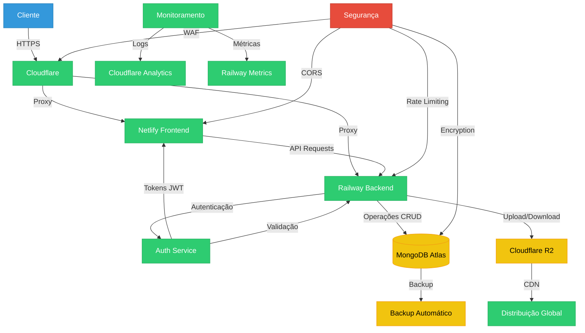

# Fluxogramas da Aplicação Robbialac Safe Zone

## 1. Fluxograma do Ponto de Vista do Usuário

```mermaid
flowchart TD
    %% Definição de estilos
    classDef start fill:#2ecc71,stroke:#27ae60,color:white
    classDef process fill:#3498db,stroke:#2980b9,color:white
    classDef decision fill:#f1c40f,stroke:#f39c12,color:black
    classDef end fill:#e74c3c,stroke:#c0392b,color:white

    %% Nós principais
    Start([Início]):::start
    Login[Login]:::process
    Dashboard[Dashboard]:::process
    Menu[Menu Principal]:::process

    %% Submenus
    Formacoes[Formações]:::process
    QuaseAcidentes[Quase Acidentes]:::process
    Acidentes[Acidentes]:::process
    Sensibilizacao[Sensibilização]:::process
    Estatisticas[Estatísticas]:::process
    Pontuacao[Pontuação]:::process
    Definicoes[Definições]:::process

    %% Fluxo principal
    Start --> Login
    Login --> Dashboard
    Dashboard --> Menu

    %% Conexões do menu
    Menu --> Formacoes
    Menu --> QuaseAcidentes
    Menu --> Acidentes
    Menu --> Sensibilizacao
    Menu --> Estatisticas
    Menu --> Pontuacao
    Menu --> Definicoes

    %% Subfluxos
    subgraph QuaseAcidentes
        QA1[Registrar QA]:::process
        QA2[Visualizar QA]:::process
        QA3[Editar QA]:::process
        QA4[Estatísticas QA]:::process
    end

    subgraph Acidentes
        AC1[Registrar Acidente]:::process
        AC2[Visualizar Acidentes]:::process
    end

    subgraph Sensibilizacao
        S1[Ver Conteúdo]:::process
        S2[Interagir/Likes]:::process
        S3[Comentar]:::process
    end

    subgraph Estatisticas
        E1[Ver Gráficos]:::process
        E2[Exportar Dados]:::process
    end

    subgraph Pontuacao
        P1[Ver Pontuação]:::process
        P2[Ver Medalhas]:::process
    end

    subgraph Definicoes
        D1[Configurar Interface]:::process
        D2[Configurar Notificações]:::process
        D3[Gerenciar Perfil]:::process
    end
```

## 2. Fluxograma da Arquitetura da Aplicação

```mermaid
flowchart TD
    %% Definição de estilos
    classDef frontend fill:#3498db,stroke:#2980b9,color:white
    classDef backend fill:#2ecc71,stroke:#27ae60,color:white
    classDef database fill:#e74c3c,stroke:#c0392b,color:white
    classDef service fill:#f1c40f,stroke:#f39c12,color:black

    %% Frontend
    subgraph Frontend[Frontend React]
        Contextos[Contextos]:::frontend
        Componentes[Componentes]:::frontend
        Servicos[Serviços]:::frontend
    end

    %% Backend
    subgraph Backend[Backend Node.js]
        Controllers[Controllers]:::backend
        Models[Models]:::backend
    end

    %% Conexões Frontend
    Contextos --> AuthContext[AuthContext]:::frontend
    Contextos --> DatabaseContext[DatabaseContext]:::frontend

    Componentes --> Layout[Layout]:::frontend
    Componentes --> UI[UI Components]:::frontend
    Componentes --> Feature[Feature Components]:::frontend

    Servicos --> AuthService[Auth Service]:::frontend
    Servicos --> APIService[API Service]:::frontend
    Servicos --> InteractionService[Interaction Service]:::frontend
    Servicos --> WhatsAppService[WhatsApp Service]:::frontend

    %% Conexões Backend
    Controllers --> AuthController[Auth Controller]:::backend
    Controllers --> InteractionController[Interaction Controller]:::backend
    Controllers --> IncidentController[Incident Controller]:::backend

    Models --> UserModel[User Model]:::backend
    Models --> IncidentModel[Incident Model]:::backend
    Models --> LikeModel[Like Model]:::backend
    Models --> CommentModel[Comment Model]:::backend

    %% Database e Integrações
    Database[(MongoDB Atlas)]:::database
    Integracoes[Integrações]:::service

    Backend --> Database
    Backend --> Integracoes

    Integracoes --> WhatsAppAPI[WhatsApp API]:::service
    Integracoes --> StorageService[Storage Service]:::service
```



## 3. Fluxograma de Fluxo de Dados e Segurança



## Como Visualizar os Fluxogramas

1. **Usando o Mermaid Live Editor**:

   - Acesse https://mermaid.live
   - Cole o código do fluxograma desejado
   - O editor irá gerar automaticamente o diagrama visual

2. **Usando o VS Code**:

   - Instale a extensão "Markdown Preview Mermaid Support"
   - Abra este arquivo
   - Use o preview do markdown para visualizar

3. **Usando o GitHub**:

   - Este arquivo pode ser visualizado diretamente no GitHub
   - Os diagramas serão renderizados automaticamente

4. **Exportando como Imagem**:
   - No Mermaid Live Editor, você pode exportar os diagramas como:
     - PNG
     - SVG
     - PDF
