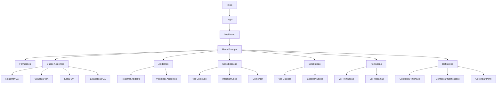

# Fluxogramas da Aplicação Robbialac Safe Zone

## 1. Fluxograma do Ponto de Vista do Usuário

## 2. Fluxograma da Arquitetura da Aplicação

```mermaid
graph TD
    A[Frontend React] --> B[Contextos]
    B --> B1[AuthContext]
    B --> B2[DatabaseContext]

    A --> C[Componentes]
    C --> C1[Layout]
    C --> C2[UI Components]
    C --> C3[Feature Components]

    A --> D[Serviços]
    D --> D1[Auth Service]
    D --> D2[API Service]
    D --> D3[Interaction Service]
    D --> D4[WhatsApp Service]

    E[Backend Node.js] --> F[Controllers]
    F --> F1[Auth Controller]
    F --> F2[Interaction Controller]
    F --> F3[Incident Controller]

    E --> G[Models]
    G --> G1[User Model]
    G --> G2[Incident Model]
    G --> G3[Like Model]
    G --> G4[Comment Model]

    E --> H[Database]
    H --> H1[MongoDB]

    I[Integrações] --> I1[WhatsApp API]
    I --> I2[Storage Service]
```

## Como Visualizar os Fluxogramas

1. **Usando o Mermaid Live Editor**:

   - Acesse https://mermaid.live
   - Cole o código do fluxograma desejado
   - O editor irá gerar automaticamente o diagrama visual

2. **Usando o VS Code**:

   - Instale a extensão "Markdown Preview Mermaid Support"
   - Abra este arquivo
   - Use o preview do markdown para visualizar

3. **Usando o GitHub**:

   - Este arquivo pode ser visualizado diretamente no GitHub
   - Os diagramas serão renderizados automaticamente

4. **Exportando como Imagem**:
   - No Mermaid Live Editor, você pode exportar os diagramas como:
     - PNG
     - SVG
     - PDF
